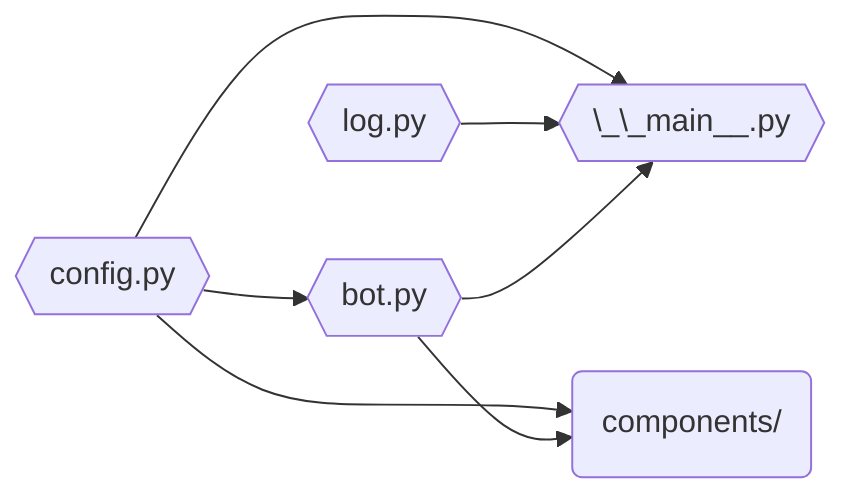

# Contributing

- [Bot setup](#bot-setup)
  - [1. Preparing a Discord application](#1-preparing-a-discord-application)
    - [1.1. Creating a Discord application](#11-creating-a-discord-application)
    - [1.2. Getting a Discord token](#12-getting-a-discord-token)
    - [1.3. Inviting the bot to your server](#13-inviting-the-bot-to-your-server)
  - [2. Getting a GitHub token](#2-getting-a-github-token)
  - [3. Creating a GitHub webhook](#3-creating-a-github-webhook)
  - [4. Preparing a Discord server](#4-preparing-a-discord-server)
  - [5. Preparing the `.env` file](#5-preparing-the-env-file)
    - [5.1. Serious channels](#51-serious-channels)
  - [6. Running the bot](#6-running-the-bot)
- [Project structure](#project-structure)

# Bot setup

> [!WARNING]
> The bot is tailor-made for the Ghostty community and will most definitely be
> unsuitable for other servers. If you're looking to use similar features, you
> should consider looking for a more general-purpose bot, or forking this
> project and modifying it to suit your needs. That said, the core intent of
> this guide is to help contributors set up their development environment for
> building and testing new features. **Contributions are the goal, not
> standalone usage.**

## 1. Preparing a Discord application

### 1.1. Creating a Discord application

1. Go to the [Discord Developer Portal][discord-docs].
2. Click on the "New Application" button.
3. Pick a name for your bot.

### 1.2. Getting a Discord token

On your newly created bot's dashboard:

1. Go to "Bot" on the sidebar.
2. Click on the "Reset Token" button.
3. Save the newly generated token for later.
4. Under "Privileged Gateway Intents", enable:
   - Server Members Intent
   - Message Content Intent

### 1.3. Inviting the bot to your server

1. Go to "OAuth2" on the sidebar.
2. Under "OAuth2 URL Generator", select the `bot` scope.
3. Under "Bot Permissions" that appears, choose the following permissions:
   - Attach Files
   - Manage Messages
   - Manage Roles
   - Manage Threads
   - Manage Webhooks
   - Send Messages
   - Use External Apps\
     (your URL should contain a `1125917892061184` bitfield for `permissions`)
4. Use the generated URL at the bottom of the page to invite the bot to your
   server.

## 2. Getting a GitHub token

A GitHub token is necessary for the bot's Entity Mentions feature.

You can get one in two ways:

- On GitHub, go to Settings > Developer settings > Personal access tokens >
  Tokens (classic) > Generate new token, or use this link:
  [Generate new token][gh-new-token]. As the bot only accesses public
  repositories, it doesn't require any scopes.
- If you have the `gh` CLI installed and authenticated, run `gh auth token`.

## 3. Creating a GitHub webhook

> [!TIP]
> This can be skipped if you're not going to interact with the bot's webhook
> feature.

The bot has a webhook feed feature which lets it stream customized GitHub repo
activity to Discord channels. In order to set up a webhook stream from your
repo:

1. Go to https://smee.io/ (any webhook relay service should work, but smee.io is
   field-tested) and choose "Start a new channel".
2. Copy the URL of your channel.
3. Go to your GitHub repository, then Settings > Webhooks > Add webhook.
4. In "Payload URL", paste in your channel's URL.
5. Set "Content type" to `application/json`.
6. Set a "Secret" (optional, but recommended). It can be any string.
7. For "Which events would you like to trigger this webhook?", it's easiest to
   choose "Send me **everything**." because the bot's webhook client still only
   triggers for events specified by hooks in the code.

More resources:

- *What are webhooks?* — [GitHub Docs][gh-webhook-docs]
- *Why is a secret recommended?* — [Monalisten Docs][monalisten-docs-warning]

## 4. Preparing a Discord server

The following **text** channels will be necessary:

- `#media`
- `#showcase`
- `#webhook`
- `#discussion-feed`
- `#botlog-everything`

Additionally, a **forum** channel named `#help` is needed. It must have the
following tags:

- Moved to GitHub
- Solved
- Stale
- Duplicate

The following roles will be necessary (both requiring the Manage Messages
permission):

- `mod`
- `helper`

## 5. Preparing the `.env` file

Create a `.env` file in the root of the project based on `.env.example`. Below
are explanations for each variable:

- `BOT_ACCEPT_INVITE_URL`: a URL to visit to accept the Ghostty invite
- Channel/role IDs from [step 4](#4-preparing-a-discord-server):
  - `BOT_GUILD_ID`: the id of the server you prepared (optional; useful when
    your bot is in multiple servers).
  - `BOT_HCB_FEED_CHANNEL_ID`
  - `BOT_HELP_CHANNEL_ID`
  - `BOT_HELP_CHANNEL_TAG_IDS`: a comma-separated list of `tag_name:tag_id`
    pairs. The tag names are `moved`, `solved`, `stale` and `duplicate`.
  - `BOT_MEDIA_CHANNEL_ID`
  - `BOT_SHOWCASE_CHANNEL_ID`
  - `BOT_LOG_CHANNEL_ID`
  - `BOT_WEBHOOK_CHANNEL_IDS`: a comma-separated list of `feed_type:channel_id`
    pairs. The feed type names are `main` and `discussions`.
  - `BOT_SERIOUS_CHANNEL_IDS`: a comma-separated list of channel ids to disable
    "fun" features in. See the guidelines below on which channels to include.
  - `BOT_MOD_ROLE_ID`
  - `BOT_HELPER_ROLE_ID`
- `BOT_DATA_DIR`: a directory path for persistent state
- `BOT_TOKEN`: the Discord bot token from
  [step 1](#1-creating-a-discord-application).
- `BOT_GITHUB_ORG`: the GitHub organization name.
- `BOT_GITHUB_TOKEN`: the GitHub token from [step 2](#2-getting-a-github-token).
- `BOT_SENTRY_DSN`: the Sentry DSN (optional).
- Webhook environment variables from [step 3](#3-creating-a-github-webhook) (if
  you skipped that section, you can use the dummy values from `.env.example`):
  - `BOT_GITHUB_WEBHOOK_URL`: the URL to receive events from.
  - `BOT_GITHUB_WEBHOOK_SECRET`: a token for validating events (optional).

### 5.1 Serious channels

Some Ghostty Bot features aren't suitable for all channels. Currently, that is:

- Asterisks missing a corresponding footnote are replied to with
  https://xkcd.com/2708.

This list can be anything you like, but here's guidelines to help you pick
serious channels:

- All channels from [section 4](#4-preparing-a-discord-server) above **should**
  be added to the serious channel list.
- These fun features were primarily created for the off-topic category of the
  Ghostty server; were you to have an equivalent of those in your server, you
  **shouldn't** add them to the serious channel list.
- If you have an equivalent of the on-topic channels like `#development`, they
  **should** be added to the serious channel list. You should probably leave a
  channel or two off the serious channel list, should you want to modify any of
  the fun features above.

## 6. Running the bot

This bot runs on Python 3.14+ and is managed with [uv]. To get started:

1. Install [uv].

2. Run the bot:

   ```sh
   uv run -m app
   ```

3. After you've made your changes, run the required checks with [just]:

   ```sh
   just check
   ```

   These checks are enforced by CI, so make sure to fix any issues shown. You
   can format all code as required by running `just format`, and fixable issues
   (including formatting issues) can have their fixes applied with `just fix`.

   <details>
   <summary>
   If you do not want to use just, you will have to run the checks manually,
   which is significantly more complicated.
   </summary>

   1. There are a large number of checks to run. CI ensures that everything is
      formatted uniformly, so first run the formatters:

      ```sh
      uv run taplo fmt pyproject.toml packages/*/pyproject.toml
      uv run ruff format
      uv run mdformat --number --wrap 80 *.md
      ```

      These must be run from the **project root**.

   2. Ghostty Bot is split into many packages. Ruff performs many checks on all
      packages at the same time. Run it from the **project root**:

      ```sh
      uv run ruff check
      ```

   3. The other checks do not work on all packages at the same time. Run these
      for **every directory under `packages`**:

      ```sh
      cd packages/<package name>
      uv run basedpyright src tests
      uv run pytest tests
      uv run taplo fmt --check --diff pyproject.toml
      ```

      For example:

      ```sh
      cd packages/toolbox
      uv run basedpyright src tests
      uv run pytest tests
      uv run taplo fmt --check --diff pyproject.toml
      ```

      Do not skip the checks for subpackages you did not modify, as subpackages
      may depend on each other.

   4. The same checks must be run for the application itself, as changes to the
      subpackages may have broken the bot. Run these from the **project root**.

      ```sh
      uv run basedpyright app tests
      uv run pytest tests
      ```

      Note that the `basedpyright` command uses **`app`, not `src`**.

   </details>

# Project structure

Ghostty Bot's code is split into multiple packages:

- The main package, containing the bot's features and integration code.
- `toolbox`, containing common code, utilities, and code to move messages.

All packages but the main one are in their own directory under `packages/`. The
main package, under `app/`, is structured as follows:



- `components/` is a place for all dedicated features ([cogs]), such as message
  filters or entity mentions. Most new features should become modules belonging
  to this package. Events (e.g. `on_ready`, `on_message`, `on_error`) should be
  defined within the component.
- `bot.py` contains custom attributes and behaviors for the overall Discord bot
  and then loads extensions found in `components`.
- `config.py` handles reading and parsing the environment variables and the
  local `.env` file, and creates the GitHub client.
- `log.py` sets up logging and optionally Sentry.
- `__main__.py` initializes logging and starts the bot.

[cogs]: https://discordpy.readthedocs.io/en/stable/ext/commands/cogs.html
[discord-docs]: https://discord.com/developers/applications
[gh-new-token]: https://github.com/settings/tokens/new
[gh-webhook-docs]: https://docs.github.com/en/webhooks/about-webhooks
[just]: https://just.systems/
[monalisten-docs-warning]: https://github.com/trag1c/monalisten#foreword-on-how-this-works
[uv]: https://docs.astral.sh/uv/
